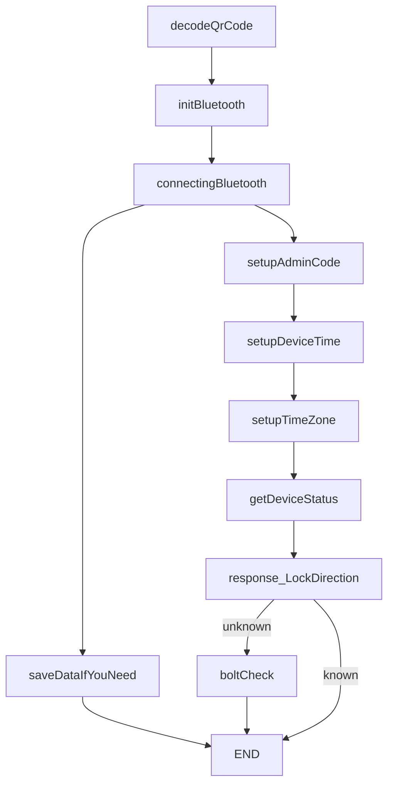

# Sunion BLE communication SDK for IOS


## System requirements
* swift 5.0+
* iOS 12.1+
* iPhone only


# Bluetooth


| Content  |
| :---- |
| [Install](#Install)|
| [Setup](#Setup)
| [Quick start](#start)
| [Version](#Version)

# Install
1. Click on Project Navigator
2. Select Targets 
3. Select Build phases 
4. Click on the + button in Link Binary With Libraries
5. Select ``SunionBluetoothTool.framework`` from the list.

# Setup
```
import SunionBluetoothTool
```
viewDidLoad
```
SunionBluetoothTool.shared.delegate = self
```
# Start
### Mandatory Process Flowchart



Before connecting to the lock, you can setup connection state observer:
```
    func bluetoothState(State: bluetoothState) {
        switch State {
        case .enable:
             // do something here
        case .disable:
            // do something here
        case .connecting:
            // do something here
        case .connected(_):
            // do something here
        case .disconnect(let disconnectState):
            switch disconnectState {
            case .fail:
                // do something here
            case .discoverServices(_):
                // do something here
            case .discoverCharacteristics:
                // do something here
            case .deviceRefused:
                // do something here
            case .illegalToken:
                // do something here
                
            }
            
        }
    }
```


### Parameter
|Parameter|Description|
|-|-|
|enable  | permission
|disable | permission
|connecting| bluetooth status
|connected| bluetooth status
|disconnected| DisconnectedState

#### DisconnectedState
|Parameter|Description|
|-|-|
|fail  | error status
|discoverServices|  error status
|discoverCharacteristics| error status
|deviceRefused| error status
|illegalToken | error status

## Connecting to lock 
```
SunionBluetoothTool.shared.initBluetooth(macAddress: String?, aes1Key: [UInt8], token: [UInt8], v3udid: String?)
```
Parameters
| Parameter | Type | Description |
| -------- | -------- | -------- |
| macAddress     | String    |  from QR code / BluetoothToolModel
| aes1Key | [UInt8] | from QR code / BluetoothToolModel
| token | [UInt8] |from QR code / BluetoothToolModel
|v3uuid|String| from QR code / BluetBluetoothToolModelooth


### Connecting to paired lock
To connect to paired lock, you should use the saved LockConnectionInfo to connect to lock.
```
let data = SunionBluetoothTool.shared.data
```
#### Parameters

##### data: BluetoothToolModel

| Name | Type | Description |
| -------- | -------- | -------- |
| macAddress     | String     | BT mac address of lock. You can get it from QR code.     |
| token     | String     | Default connection token of lock. You can get it from QR code.     |
| permanentToken     | String     | Excanged connection token when pairing with lock. You should save it for later use.    |
| aes1Key     | String     | Encryption key of data transmission. You can get it from QR code.     |
| aes2Key     | String     | Random-generated encryption key of data transmission.     |
| permission     | TokenPermission     | Permission of connection token.     |
| qrCodeShareFrom| String| share from who
| qrCodeSerialNumber| String | SerialNumber
| qrCodeDisplayNmae| String |  name of device
| modelName| String |  name of device model
| FirmwareVersioin| String | version of device firmware
| RFVersion| String | version of RF
| bleNmae | String | Bluetooth broadcast name
| identifier| String| Bluetooth connted UUID
|uuid| String| from qrcode


# Version

| version  | Description |File Name 
| --------  | -------- | --|
| v1, v2| Preliminary version of Bluetooth commands| Version1
|v3| includes Matter Device | Version3
